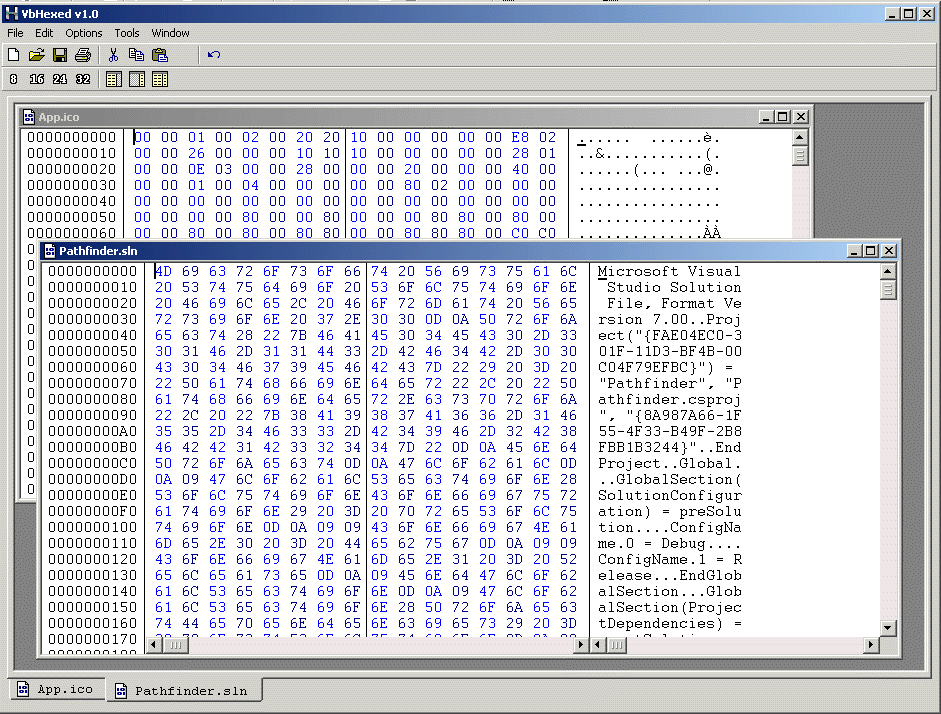



## VB HexEditor

### Description

quite nasty hexeditor in vb6 

can handle files upto 2.1 gb (uses a custom  filebuffer to avoid loading all data at once) 

 

supports copy paste , delete / insert bytes and multiple documents.. 

 

i saw some other guy has submitted his hexeditor so i figure i could just as well submit mine to instead of letting it just rott on my hd... 

 

its not finnished but its still quite nice , hope you like it... 

 

start hexed.vbp 

 

list of features: 

 

filebuffer (load files upto 2.1 gb) 

copy paste data in both hex/text mode 

mdi app 

custom scrollbar to allow more than 32k lines 

file compare tool , compare 2 or more files 

string extractor , extract strings (ansii/unicode) 
 
### More Info
 

             |
---                |---
**Submitted On**   |2002-05-12 22:22:20
**By**             |[Rang3r](https://github.com/Planet-Source-Code/PSCIndex/blob/master/ByAuthor/rang3r.md)
**Level**          |Intermediate
**User Rating**    |4.8 (116 globes from 24 users)
**Compatibility**  |VB 5\.0, VB 6\.0
**Category**       |[Files/ File Controls/ Input/ Output](https://github.com/Planet-Source-Code/PSCIndex/blob/master/ByCategory/files-file-controls-input-output__1-3.md)
**World**          |[Visual Basic](https://github.com/Planet-Source-Code/PSCIndex/blob/master/ByWorld/visual-basic.md)
**Archive File**   |[VB\_HexEdit823245122002\.zip](https://github.com/Planet-Source-Code/rang3r-vb-hexeditor__1-34729/archive/master.zip)

